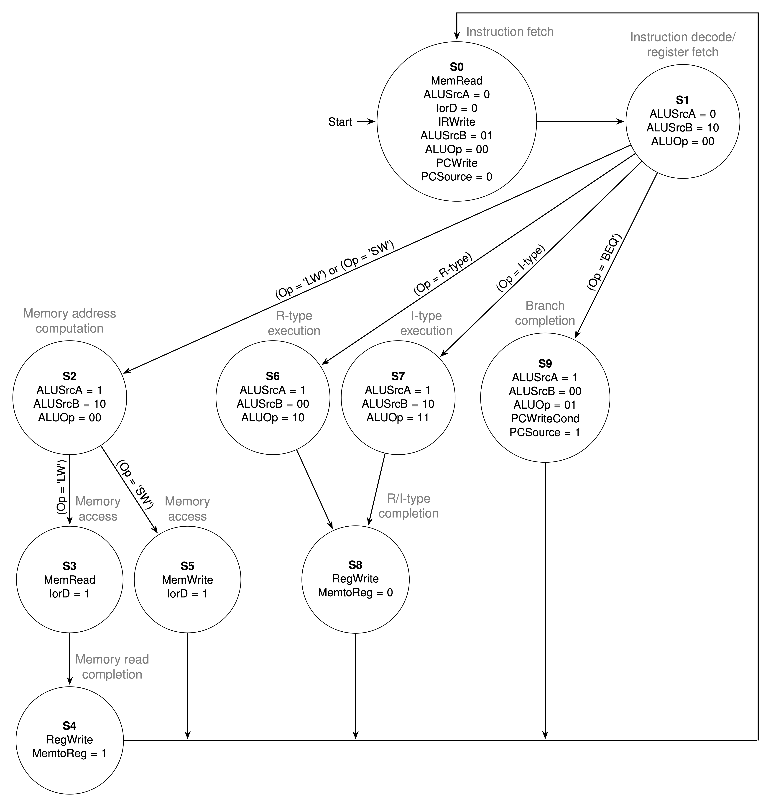

# riscv-cpu-verilog

A personal project implementing a 32-bit RISC-V processor from scratch using Verilog HDL.

## 🚀 Progress
- [x] **Single-Cycle CPU**
  - Supported instructions:
    | R-type | I-type | S-type | J-type | B-type | U-type |
    | :----: | :----: | :----: | :----: | :----: | :----: |
    |  ADD   | ADDI   |   SW   |  JAL   |  BEQ   | LUI    |
    |  SUB   | SLTI   |        |        |  BNE   | AUIPC  |
    |  SLL   | SLTIU  |        |        |  BLT   |        |
    |  SLT   | XORI   |        |        |  BGE   |        |
    |  SLTU  | ORI    |        |        |  BLTU  |        |
    |  XOR   | ANDI   |        |        |  BGEU  |        |
    |  SRL   | SLLI   |        |        |        |        |
    |  SRA   | SRLI   |        |        |        |        |
    |  OR    | SRAI   |        |        |        |        |
    |  AND   | LW     |        |        |        |        |
    |        | JALR   |        |        |        |        |
- [x] **Multi-Cycle CPU**
  - Supported instructions:
    | R-type | I-type | S-type | B-type |
    | :----: | :----: | :----: | :----: |
    |  ADD   |  ADDI  |   SW   |  BEQ   |
    |  SUB   |  SLTI  |        |        |
    |  SLT   |  ORI   |        |        |
    |  OR    |  ANDI  |        |        |
    |  AND   |  LW    |        |        |
  - The finite state machine (FSM) used in the control unit is as follows:
    
- [ ] **Pipelined CPU**

## 🛠️ Simulation
This project uses **Verilator** for simulation and **GTKWave** for waveform visualization. A `Makefile` is provided to automate the build and execution process.
### How to Run
```bash
# Clone the repository
git clone https://github.com/jihochoiii/riscv-cpu-verilog.git

# Move to the source directory
cd riscv-cpu-verilog/single-cycle/

# Compile Verilog to C++, build the executable, and run the simulation
make

# Open the generated 'waveform.vcd' file
make wave
```

## ⚙️ FPGA Implementation
Successfully ported the **Single-Cycle RISC-V CPU** to the **Digilent Basys 3 FPGA**.
### Key Features
- **Memory-Mapped I/O (MMIO)**: CPU communicates with hardware peripherals using standard `lw`/`sw` instructions.
- **7-Segment "Crawling Snake"**: The processor executes a specialized machine code program to display a crawling snake animation across the 4-digit 7-segment LED.
- **Interactive Control**: Real-time direction and speed regulation of the animation via physical slide switches.
### How to Run
1. Create a new project in **Xilinx Vivado**.
2. Add all source files and the `.xdc` constraints file from the `single-cycle-fpga/` directory.
3. Select the "xc7a35tcpg236-1" part (for Basys 3).
4. Run Synthesis, Implementation, and Generate Bitstream.
5. Program the Basys 3 board and observe the crawling snake.
6. Use the on-board switches to adjust the animation's direction and speed in real-time.

## 📚 References
- Lab sources provided by [Computer Organization 2024](https://github.com/nycu-caslab/CO2024_source/tree/main) course at NYCU
- Lab sources provided by [Digital Design and Computer Architecture (Spring 2025)](https://safari.ethz.ch/ddca/spring2025/doku.php?id=start) course at ETH Zürich
- *Computer Organization and Design: RISC-V Edition (2nd Edition)* by Patterson & Hennessy
